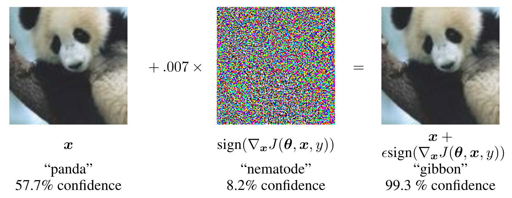

# 对抗攻击与对抗训练

- [对抗攻击与对抗训练](#对抗攻击与对抗训练)
  - [问题定义](#问题定义)
  - [生成对抗样本](#生成对抗样本)
    - [FGSM](#fgsm)
    - [PGD](#pgd)
  - [对抗训练](#对抗训练)
  - [Reference](#reference)

对于一个用于分类任务的模型来说，由于训练数据的限制(无法覆盖全空间)，模型往往会出现预测错误的情况。所谓的对抗样本就是一种特殊的使模型预测错误的样本，这些样本往往是在原始样本的基础上添加了一些人眼无法察觉的扰动，也就是说人眼无法区分两张图片，但这两张图片会被模型分为不同的类别。而对抗训练就是针对对抗攻击的一种防御方法，通过训练过程的调整提高模型的鲁棒性。

## 问题定义

[这篇文章](https://arxiv.org/abs/1706.06083)将对抗攻击与训练统一成了一个Min-Max问题，即:
$$\min_{\theta}\quad \mathbb{E}_{(x,y)\sim D}\left[\max_{\delta \in S}L(f_{\theta}(x+\delta), y)\right]$$
其中 $f_\theta(\cdot)$ 是被攻击的分类模型； $D$ 是训练集, $x$ 和 $y$ 分别是输入样本和对应的真实标签； $S$ 是扰动的限制域, 一般扰动被限制在以 $x$ 为中心, $\epsilon$ 为半径的超球内, 距离的度量一般选择 $l_p$ 范数；$L$ 是损失函数, 一般选取交叉熵损失。

内部的 $\max$ 问题是在找以 $x$ 为中心, $\epsilon$ 为半径的超球内使得损失函数最大的点, 也就是对抗样本。外部的 $\min$ 问题是找到一个模型参数 $\theta$ 使得内部的最大损失最小，也就是使得模型更加鲁棒。

直接求解这个Min-Max问题是困难的，因此一般采用近似的方法来求解。

## 生成对抗样本

[这篇文章](https://arxiv.org/abs/1412.6572)认为模型的**线性**性是对抗样本存在的原因。考虑线性模型 $f(x)=w^Tx$ （其中$w\in\mathbb{R}^{n\times 1}$, $x\in\mathbb{R}^{n}$），对于一个样本 $x$，其对抗样本 $x' = x + \delta$ 满足:
$$f(x') = f(x) + w^T\delta$$

取 $\delta = \epsilon \cdot \text{sign}(w)$，若 $w$ 所有元素的绝对值的平均值为 $m$ ，则模型的输出将以 $\epsilon mn$ 增长，也即随着向量的维度增加而增长；另一方面， $\| x'-x \|_{\infty} = \epsilon$ 即对抗样本是在以 $x$ 为中心, $\epsilon$ 为半径的超球面上，当 $\epsilon$ 足够小时，对抗样本与原始样本的距离很小，人眼无法区分，并且 $\| x'-x \|_{\infty}$ 不会随着向量维度增加而增加。上面的分析表明，**在高维情形下，我们可以对输入作足够小的修改，却能让模型的输出发生巨大的变化**，这就是对抗样本产生的本质。

### FGSM

对于一般的模型来说，其输出 $f(x)$ 一般是非线性的，但是可以通过线性化的方法来近似，即:
$$f(x') \approx f(x) + \nabla_x f(x)^T\delta$$

因此，我们可以取 $x' = x + \epsilon \cdot \text{sign}(\nabla_x f(x))$ 来生成对抗样本。但是，一般来说 $f(x)$ 是一个概率向量，表示预测为每一类的概率，为了获得一个标量值(与前面的 $f(x)=w^Tx$ 一致)，我们在此基础上求损失函数(cross entropy)后再求梯度，因此对抗样本的生成可以进一步改写为:
$$x' = x + \epsilon \cdot \text{sign}(\nabla_x L(f(x), y))$$

由于上面的推导中不涉及模型本身的参数 $\theta$ 的优化，因此我们将所有的 $f_{\theta}(x)$ 简写为 $f(x)$ 。注意到 $\nabla_x L(f(x), y)$ 其实指明了对于输入 $x$ 而言，损失函数变化最快的方向。如果 $x$ 沿着这个方向进行变化，那么相对于其他方向而言，此方向对 $L$ 的影响是最大的，也就是最有机会改变分类结果。这一方法也被称为**Fast Gradient Sign Method(FGSM)**。

 

另外，上面的符号函数 $\text{sign}$ 还可以理解为梯度的 $\max$ 归一化。

### PGD

FGSM方法假定损失函数是局部线性的，[这篇文章](https://arxiv.org/abs/1706.06083)通过多次迭代的方法来处理损失函数非线性的情况，这一方法也被称为Projected Gradient Descent(PGD)。具体来说，它将对抗样本的生成分解为 $I$ 次迭代，每一次迭代有：
$$x_{i+1}' = \mathcal{P}_{x, \epsilon} \left( x_i'+ \alpha \cdot \text{sign}(\nabla_{x_i'} L(f(x_i'), y)) \right)$$
其中 $i=0,1,\cdots,I-1$ , $x=x_0'$ , $x'=x_{I-1}'$ ；$\mathcal{P}_{x, \epsilon}(\cdot)$ 是对 $x$ 限制在以 $x$ 为中心, $\epsilon$ 为半径的超球面上的投影函数；$\alpha$ 是每一次迭代的步长。

由于每次只走很小的一步，所以局部线性假设是成立的。经过多步迭代之后就可以达到(局部)最优解了。PGD虽然简单有效，但是存在计算效率不高的问题，因为每产生一个对抗样本都需要计算 $I$ 次梯度。

## 对抗训练

1. 一种朴素的提升模型鲁棒性的方法就是利用上述方法生成对抗样本，然后加入到训练集中重新训练。但这种方法存在局限性，仅仅用少量的对抗样本去训练显然无法覆盖到所有的情形，你降低了样本附近某几个对抗点的loss，但是还可能有一大堆的其他对抗攻击点没有被训练到。

2. 另一种方法是修改训练过程的Loss function：
$$\tilde{L}(f_\theta(x), y) = \alpha L(f_\theta(x), y) + (1-\alpha) L(f_\theta(x + \epsilon \cdot \text{sign}(\nabla_x L(f_\theta(x), y))), y)$$
相当于直接融入了对抗样本的损失，其中 $\alpha$ 是一个超参数，用于控制对抗样本的权重。

3. [这篇文章](https://arxiv.org/abs/1706.06083)从Min-Max问题的角度来提升模型鲁棒性。首先为了求解内部的 $\max$ 问题，论文通过在训练样本附近$l_{\infty}$球内随机采样一些点，然后用PGD的方法迭代至收敛，选取这些对抗样本中最大的Loss作为 $\max$ 问题的解。实验表明，尽管PGD的方法理论上只能保证获取局部Loss最大的对抗样本，但是这些对抗样本往往具有相似的Loss值，因此可以作为近似的全局最优解。接着，通过随机梯度下降的方法优化模型参数 $\theta$ 以降低这一最大Loss，以此来求解外部的 $\min$ 问题。

## Reference
- [浅读Towards Deep Learning Models Resistant to Adversarial Attacks](https://zhuanlan.zhihu.com/p/76201268)
- [对抗训练](https://www.zkxjob.com/31654)
- [Explaining and Harnessing Adversarial Examples论文笔记](https://zhuanlan.zhihu.com/p/166364358)