# Language Model

- [Language Model](#language-model)
  - [Two kinds of Models](#two-kinds-of-models)
    - [Autoregressive Language Model](#autoregressive-language-model)
    - [Autoencoding Language Model](#autoencoding-language-model)
  - [BLEU](#bleu)
  - [基于词的评价文档间相关性的指标](#基于词的评价文档间相关性的指标)
    - [TF-IDF](#tf-idf)
    - [BM25](#bm25)
  - [RNN](#rnn)
  - [Seq2Seq](#seq2seq)
  - [Attention](#attention)
  - [Transformer](#transformer)
    - [Self-Attention](#self-attention)
    - [Encoder](#encoder)
    - [Decoder](#decoder)
  - [LoRa](#lora)
  - [Vision Transformer](#vision-transformer)
  - [Reference](#reference)

## Two kinds of Models

### Autoregressive Language Model

自回归模型即在给定之前的所有token, 输出下一个token是什么(指利用上文信息或者下文信息), 是单向的。给定源语句 $(x_1, \cdots, x_m)$ , 目标语句 $(y_1, \cdots, y_n)$ 是按照如下的方式生成的:

$$p(y|x) = \prod_{t}{p(y_t|y_{\lt t},x)}$$

$t$ 是当前的时刻,  $y_{\lt t}$ 是当前时刻已经生成的token, 由于前后的依赖关系, AR模型的生成往往需要 $O(n)$ 次循环。AR模型适合用于自然语言生成(NLG)任务。GPT是典型的自回归模型, 缺点是生成速度慢, non-autoregressive模型就是想要减少生成时的循环次数。

### Autoencoding Language Model

自编码模型是把输入token打乱, 学习出一个中间表示(隐空间), 再用这个中间表示还原出原始的序列。BERT作为典型的AE模型就是通过mask掉一部分token, 再重建恢复原始序列。AE模型能较好地编码上下文信息, 因此擅长自然语言理解(NLU)的任务。

## BLEU

BLEU全称是 *Bilingual Evaulation Understudy*, 意思是双语评估替补。它是一种评估机器翻译质量的方法, 也可以推广到其他NLP问题中。

假设参考翻译集合为: 

```
The cat is on the desk.
There is a cat on the desk.
```

那么很自然想到, 用*实际翻译结果中出现在参考翻译中的单词数*除以*实际翻译结果单词总数*, 来评估结果的好坏。例如, 若翻译结果为`The cat are on the desk`。则评分为: $5/6$ , 只有`are`没有出现, 这看起来是合理的。但是若翻译结果为`is is is is is is is`, 那么很显然, 评分为 $6/6$ , 因为`is`在参考翻译句子中出现了。很明显, 这这种方案不合理。

错误出现在对单词的计数不合理, 一个解决方法是, 我们规定*实际翻译结果中每个单词的计数*不得超过在*单个参考翻译中出现的最大次数*。在上述`is is is is is is`翻译结果中, 单词`is`在参考翻译中出现的最大次数是 $1$ , 因此, 只能被记 $1$ 次, 评分为 $1/6$ , 这是比较合理的。

另外结果的顺序也需要考虑, 假如实际翻译句子为`desk the on cat a is there`, 那么得分为 $7/7$ , 虽然单词都出现了, 但结果却没有意义。因此, 根据“平滑”的思想, 进一步考虑`1-gram`到`4-gram`。具体来说：我们除了对单个单词计数, 还对2、3、4个单词组成的词组进行计数。 $n = 1,2,3,4$ 时 , 每 $n$ 个单词为一组, 设实际翻译中每个元素为 $x_i^n$ , 则有:

$$score_n = \sum_i{x_i^n在参考翻译中出现的最大次数}\quad / \quad \sum_i{x_i^n在实际翻译中出现的次数}$$

paper中的 $\mathbf{BLEU}$ 一般取为:

$$\mathbf{BLEU} = \exp \left(\sum_{n=1}^4 score_n \right)$$

最大时四个 $score$ 均为 $1$ , $\mathbf{BLEU}_{max} = e^4 \approx 54.598$ .

## 基于词的评价文档间相关性的指标

### TF-IDF

它是一种判别一个词在文章中的**重要程度**的指标，其计算方式如下:

- 计算词频 $tf$ , 即一个词在文章中出现的次数；
- 考虑到文章有长有短，将词频标准化 $tf = \frac{tf}{文章总词数}$ ；
- 计算逆文档频率 $idf = \log \frac{语料库的文章总数}{语料库中包含该词的文章数 + 1}$ , 如果一个词越常见, 那么说明它越不重要, 此时 $idf$ 值越小；
- `tf-idf` $= tf \times idf$ .

### BM25

它是一种用来评价**搜索词和文档之间相关性**的算法，基于概率检索模型提出。给定查询 $q$ (查询中第 $i$ 个词为 $q_i$ ) 和文档 $d$ (语料库中总共有 $N$ 篇文章, $d$ 是其中任意一篇)，其计算方式如下:

- 计算单词权重也即 $idf$ , 不过这里的计算公式和`tf-idf`中的略有不同, 在这里, $idf(q_i) = \log \frac{N-df_i+0.5}{df_i+0.5}$ , 其中 $df_i$ 为语料库中包含单词 $q_i$ 的文章数；
- 计算单词与文档的相关性。`BM25`的设计依据一个重要的发现：词频和相关性之间的关系是**非线性**的，也就是说，每个词对于文档的相关性分数不会超过一个特定的阈值，当词出现的次数达到一个阈值后，其影响就不在线性增加了，而这个阈值会跟文档本身有关。因此，在刻画单词与文档相似性时，`BM25`是这样设计的： $S(q_i, d) = \frac{(k_1+1)tf_{id}}{k_1(1-b+b*\frac{L_d}{L_{avg}}) + tf_{id}}$ 其中, $tf_{id}$ 是单词 $q_i$ 在文章 $d$ 中出现的次数(标准化后), $L_d$ 是文章 $d$ 的长度, $L_{avg}$ 是语料库中所有文章的平均长度, $k_1$ 和 $b$ 是两个超参数, 分别用于标准化文章词频的范围以及调节使用文档长度来表示信息量的权重，实际应用中一般取 $k_1=1.2 \sim 2, b=0.75$ ；
- 计算单词与查询的相关性。 $R(q_i, q) = \frac{(k_3+1)tf_{iq}}{k_3+tf_{iq}}$ 其中, $tf_{iq}$ 是单词 $q_i$ 在查询 $q$ 中出现的次数(标准化后), $k_3$ 是一个超参数，用于标准化查询中词频的范围，实际应用中一般取 $k_3=1.2 \sim 2$ .
- $BM25(q_i, q, d)=idf(q_i) \times S(q_i, d) \times R(q_i, q)$

## RNN

前向神经网络在很多任务中都取得不错的效果, 但是这些网络结构的通常比较适合用于一些不具有**时间或者序列依赖性**的数据, 即输入通常与上一时刻的输入没有关系。但是序列数据不同, 输入之间存在着先后顺序, 当前输入的结果通常与前后的输入都有关。例如一段句子包含 4 个输入单词 ：*“我”*、*“去”*、*“商场”*、*“打车”*, 4 个单词通过不同的顺序排列, 会有不同的意思, *“我打车去商场”* 和 *“我去商场打车”*。因此我们通常需要按照一定的顺序阅读句子才能理解句子的意思。

面对这种情况我们就需要用到**循环神经网络**(RNN)了, 循环神经网络按照顺序处理所有的输入, 每一时刻 $t$, 都会存在一个向量 $h_t$ 保存与 $t$ 时刻相关的信息 (可以是 $t$ 时刻前的信息或者 $t$ 时刻后的信息)。通过向量 $h_t$ 与输入向量 $x_t$ , 就可以比较准确地判断当前的结果。RNN 按时刻展开的结构如下图所示：

<div align=center>
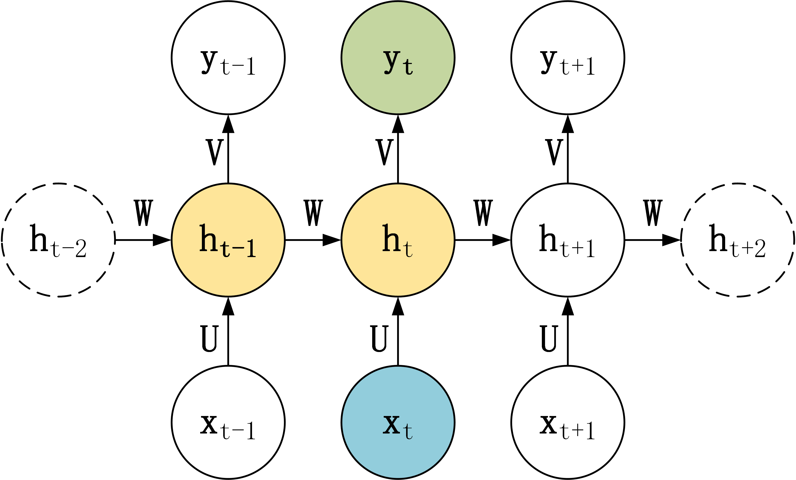
</div>
</br>

可以发现, 在 $t$ 时刻, 网络接收的数据包括前一时刻的隐态 $h_{t-1}$ 和当前时刻的输入 $x_t$ , 具体的计算公式为:

$$h_t = \sigma_1(Ux_t+Wh_{t-1}+b_1)$$

$$y_t = \sigma_2(Vh_t + b_2)$$

其中 $U,V,W$ 为参数矩阵, $b_1,b_2$ 为偏置向量, $\sigma_1,\sigma_2$ 为激活函数。当序列较长时, RNN可能会遇到**梯度消失**和**梯度爆炸**的问题, 主要原因是梯度中出现了连乘项 $\prod{\frac{\partial h_i}{\partial h_{i-1}}}$ . 为了解决这个问题, 我们可以使用*长短期记忆网络(LSTM)*和*门控循环单元网络(GRU)*, 详细介绍可以参考[这里](https://www.jianshu.com/p/247a72812aff)。

另外, RNN也存在一些变种, 包括:

- *N vs N*: 输入和输出序列的长度是相等, 适用于词性标注以及自然语言理解等任务。

<div align=center>
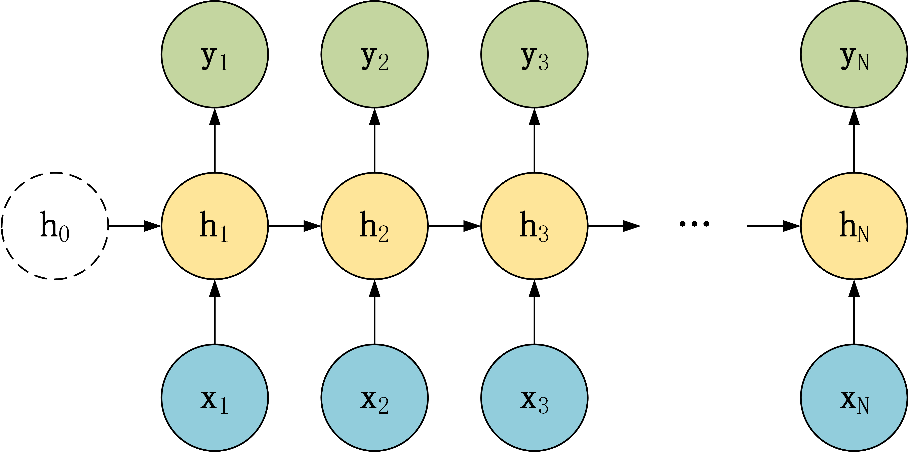
</div>
</br>

- *1 vs N*: 输入只有一个 $x$ , 输出是一个序列, 适用于图片生成文字, 类别生成小说等任务。

<div align=center>
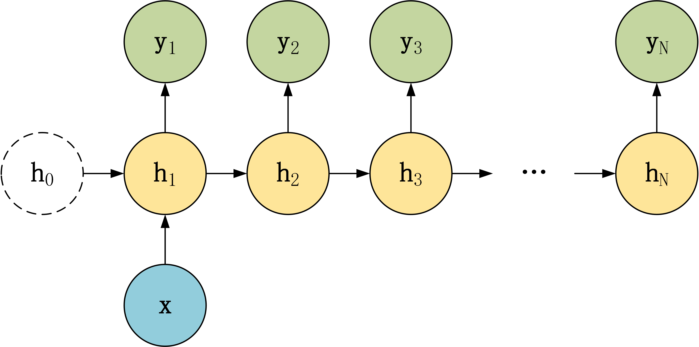
</div>
</br>

- *N vs 1*: 输入是一个序列, 输出只有一个 $y$ , 适用于文本分类等任务。

<div align=center>
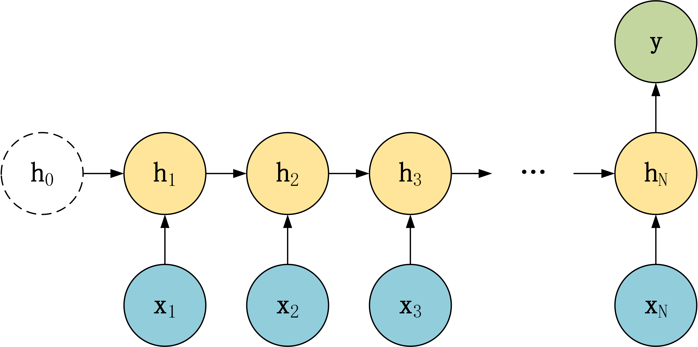
</div>
</br>

## Seq2Seq

上面的三种结构对于 RNN 的输入和输出个数都有一定的限制, 但实际中很多任务的序列的长度是不固定的, 例如机器翻译中, 源语言、目标语言的句子长度不一样；对话系统中, 问句和答案的句子长度不一样。**Seq2Seq** 是一种重要的 RNN 模型, 也称为 **Encoder-Decoder** 模型, 可以理解为一种 *N vs M* 的模型。模型包含两个部分：Encoder 用于编码序列的信息, 将任意长度的序列信息编码到一个向量 $c$ 里。而 Decoder 是解码器, 解码器得到向量 $c$ 之后可以将信息解码, 并输出为序列。Seq2Seq 模型结构有很多种, Encoder部分基本一致, 主要差异在Decoder部分：

- 将上下文向量 $c$ 当成是 RNN 的初始隐藏状态, 输入到 RNN 中, 后续只接受上一个神经元的隐藏层状态 $h^{\prime}$ 而**不**接收其他的输入 $x$ .

<div align=center>
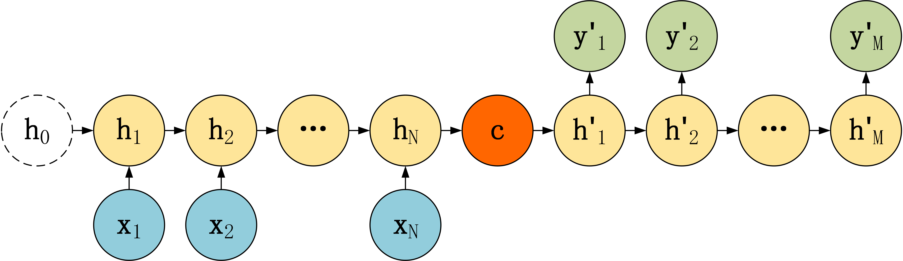
</div>
</br>

- 有自己的初始隐藏层状态 $h^{\prime}_0$ , 不再把上下文向量 $c$ 当成是 RNN 的初始隐藏状态, 而是当成 RNN 每一个神经元的输入。

<div align=center>
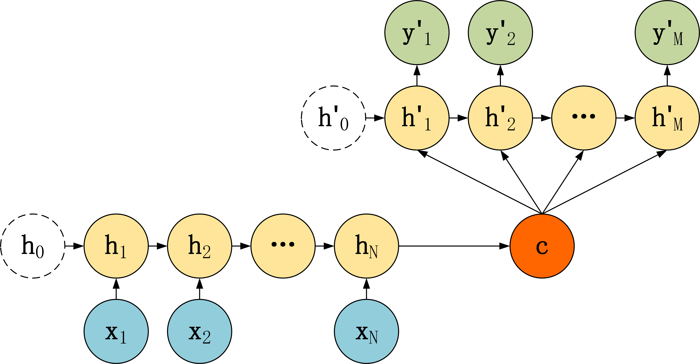
</div>
</br>

- 和第二种类似, 但是在输入的部分多了上一个神经元的输出 $y^{\prime}$ 。即每一个神经元的输入包括: 上一个神经元的隐藏层向量 $h_{t-1}^{\prime}$ , 上一个神经元的输出 $y_{t-1}^{\prime}$ , 上下文向量 $c$ .

<div align=center>

</div>
</br>

针对上面的第三种结构, 有一些针对性的优化方法:

在training阶段, 按照第三种结构, 每一时间片的输入包含上一时间片的输出, 如果上一时间片出错, 则会使错误累加, 为了缓解这种情况, 一般使用**teacher forcing**的方法, 即当前时间片的输入不一定要使用上一时间片的输出, 可以以一定的概率使用正确的答案作为输入。

在inference阶段的Decoder中, 一般使用**beam search**算法, 以获得最优的输出序列。在每次Decoder的输出中我们选取概率最大的 $k$ 个词(序列)然后进行下一步的预测。(由于每一个时间片都会把之前的结果输入进Decoder，因此当前时间片选择不同的词会影响下一步的预测结果。)

## [Attention](https://arxiv.org/abs/1409.0473)

上述模型的问题在于只将编码器的**最后一个节点**的结果进行了输出, 但是对于一个序列长度特别长的特征来说, 这种方式无疑将会*遗忘大量的前面时间片的特征*。与其输入最后一个时间片的结果, 不如将每个时间片的输出都提供给解码器, 那么解码器如何使用这些特征就是Attention的作用。

Attention是一个介于编码器和解码器之间的一个接口, 用于将编码器的编码结果以一种更有效的方式传递给解码器。一个特别简单且有效的方式就是让解码器知道哪些特征重要, 哪些特征不重要, 即让解码器明白如何进行*当前时间片的预测结果和输入编码的对齐*, Attention模型学习了编码器和解码器的对齐方式, 因此也被叫做对齐模型(Alignment Model), 如下图所示。

<div align=center>
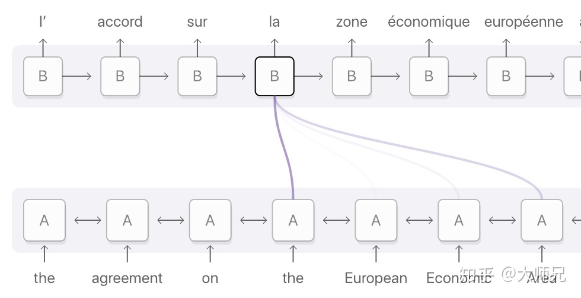
</div>
</br>

Attention有两种类型, 一种是作用到编码器的全部时间片, 叫做**Global Attention**, 另外一种值作用到时间片的一个子集, 叫做**Local Attention**, 这里介绍的Attention都是全局的。

<div align=center>
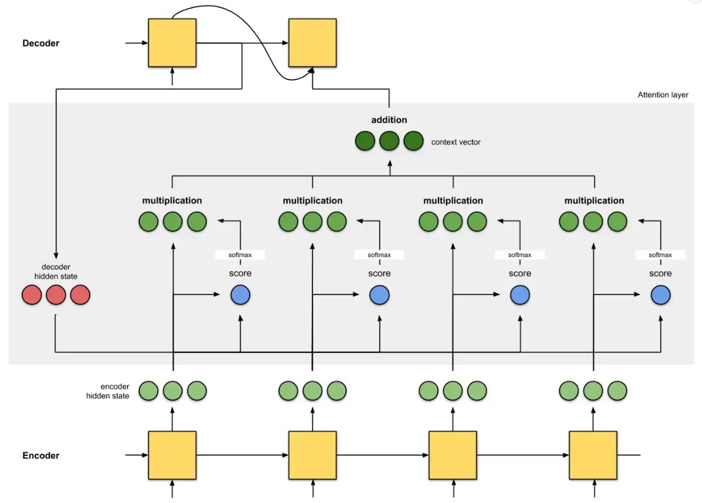
</div>
</br>

Attention计算主要可以分为5步:

- 第一步: Encoder计算得到全部时间片的隐层状态 $h_1, \cdots, h_T$ , 并将编码器最后一个时间片输出的结果 $c$ 作为Decoder的初始状态 $h_{0}^{\prime}$ 。
- 第二步: 用Decoder当前隐层状态 $h_{t}^{\prime}$ 与Encoder得到的隐层状态 $h_1, \cdots, h_T$ 计算得分 $score_1^t, \cdots, score_T^t$ (如使用点乘操作), 本质是计算当前解码的时间片与编码器的每个时间片的**相关性**。
- 第三步: 用softmax函数计算得到权重 $a_1^t, \cdots, a_T^t$ .
- 第四步: 用权重 $a_1^t, \cdots, a_T^t$ 与Encoder得到的隐层状态 $h_1, \cdots, h_T$ 进行按位乘操作, 得到当前时间片的注意力特征(Attention Vector) $z_1^t, \cdots, z_T^t$ 。
- 第五步: 把得到的注意力特征变换为一个单一的向量, 可以是求和、拼接等其它方法, 把这一向量输入到Decoder中进行下一个时刻的计算。

## [Transformer](https://arxiv.org/abs/1706.03762)

Transformer也是一种Encoder-Decoder模型, 论文中提到的模型包含6层Encoder和6层Decoder, 其结构如下左图所示。每一组Encoder和Decoder由且仅由**self-Attenion**和**Feed Forward Neural Network**组成，如下右图所示。

<div align=center>
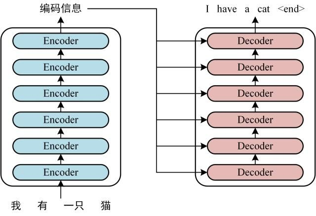
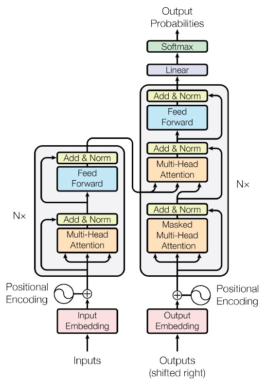
</div>
</br>

Transformer的大致工作流程如下:

- 获取输入文本的embedding, 包含**词向量**(可以通过Word2Vec等方式得到，也可以在Transformer中得到)和**位置向量**(因为Transformer不采用RNN的结构，而是使用全局信息，这样就不能利用单词的顺序信息，使用位置向量可以解决这一问题。位置向量可以通过训练得到也可以用公式计算得到)。
- 将所有embedding拼接为一个矩阵 $X$ 作为Encoder的输入, 通过6层Encoder得到与输入大小相同的词编码矩阵 $C$ 。
- 把 $C$ 传入到Decoder中, 同时最下层Decoder还会接收已经预测出的所有结果作为输入(具体实现为mask)。Decoder的最后输出再经过一个全连接层以及softmax得到反映词概率的向量。

接下来我们将先介绍自注意力机制(self-Attenion), 然后详细介绍Encoder和Decoder的内部结构。

### Self-Attention

Self-Attention 的计算过程如下:

<div align=center>
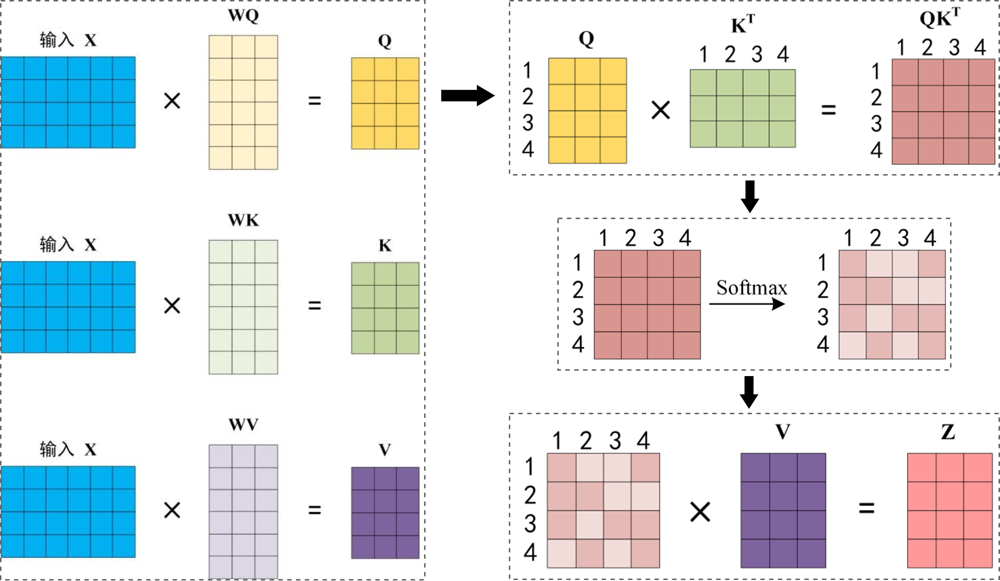
</div>
</br>

- 首先将输入的词向量 $X$ 通过线性变换得到 $Q, K, V$ 三个矩阵(`Query`, `Key`, `Value`)。

$$Q=W_Q \times X$$

$$K=W_K \times X$$

$$V=W_V \times X$$

- 计算`Query`和`Key`的相似度, 其中 $d_k$ 是方阵 $QK^T$ 的维度, 等于文本词的数目。 $QK^T$ 的第 $i$ 行表示第 $i$ 个词与所有词的相似度。

$$Score(Q,K) = softmax \left( \frac{Q \times K^T}{\sqrt{d_k}} \right)$$

- 用 $Score$ 和`Value`相乘得到`Attention`。结果有 $d_k$ 行, 第 $i$ 行是所有词的 `Value` 加权求和得到的注意力向量, 权重为第 $i$ 个词和其它词的相似度。

$$Attention(Q,K,V) = Score(Q,K) \times V$$

Multi-Head Attention 是由多个 Self-Attention 组合形成的, 首先将输入 $X$ 分别传递到 $h$ 个不同的 Self-Attention 中，计算得到 $h$ 个输出矩阵 $Z_1, \cdots, Z_h$ , 接着将它们拼接(Concat)在一起, 然后通过一个Linear层, 得到和输入维度相同的最终的输出 $Z$ , 计算公式如下:

$$Z = W_Z \times [Z_1, \cdots, Z_h]^T$$

### Encoder

每一个Encoder包含一个Multi-Head Attention层和一个Feed Forward层, 且使用残差连接和Layer Normalization(将输入变换为均值方差一致)来解决多层网络训练的退化问题并加快收敛速度。具体的Encoder的计算过程如下:

$$Y = LayerNorm(X + \mathbf{MultiHeadAttention}(X))$$

$$Z = LayerNorm(Y + \underbrace{\max (0, YW_1+b_1)W_2+b_2}_{\mathbf{FeedForward}(Y)})$$

其中Feed Forward Net是两个全连接层, 第一层激活函数为Relu, 第二层没有激活函数。

### Decoder

Decoder和Encoder结构基本相似，每一个Decoder包含两个个Multi-Head Attention层和一个Feed Forward层, 但这两个Multi-Head Attention层和Encoder的略有区别。

第一个 Multi-Head Attention 层中的 Self-Attention 带有**Mask操作**。这是因为在翻译的过程中是顺序翻译的，即翻译完第 $i$ 个单词，才可以翻译第 $i+1$ 个单词, 因此Decoder在解码第 $i$ 个词时只能看到前 $i-1$ 个词的信息。(*注意，这里的Mask和Transformer中输入给最下层Decoder embeddings时的Mask操作不同, 那个是直接Mask当前时间片生成词及之后的所有embedding信息*)

具体的操作是在计算softmax**之前**给 $QK^T$ 矩阵**按位乘**上一个Mask矩阵, 如下图所示:

<div align=center>
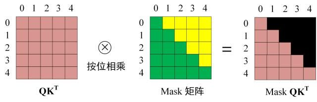
</div>
</br>

之后的操作和原始的Self-Attention一样, 只不过用 $\mathbf{Mask}\ QK^T$ 替代了原始的 $QK^T$ .

第二个 Multi-Head Attention 主要的区别在于其中 Self-Attention 的 $K$ , $V$ 矩阵不是用上一个Decoder block的输出 $X$ 计算的，而是使用 Encoder编码出信息矩阵 $C$ 计算的。这样做的好处是在解码的时候，每一个词都可以利用到Encoder编码的所有单词的信息(这些信息无需Mask)。

因此, Decoder的整个计算过程可以描述为:

$$X_2 = LayerNorm(X_1 + \mathbf{MaskMultiHeadAttention}(X_1))$$

$$Y = LayerNorm(X_2 + \mathbf{MultiHeadAttention}(C, X_2))$$

$$Z = LayerNorm(Y + \mathbf{FeedForward}(Y))$$

## LoRa

[LoRA](https://link.zhihu.com/?target=https%3A//arxiv.org/abs/2106.09685) (Low-Rank Adaptation of Large Language Models)，即大语言模型的低阶适应，是一种高效完成大语言模型微调的方法。LoRA的核心思想是将大语言模型的参数分解为两个矩阵的乘积，其中一个矩阵是低秩的，另一个矩阵是高秩的。**低秩**矩阵可以被视为一个**通用的语言模型** (Pre-trained Model, 下图中的 $W$ )，而**高秩**矩阵可以被视为一个**特定任务的适应模型** (下图中的 $A, B$ )。

<div align=center>
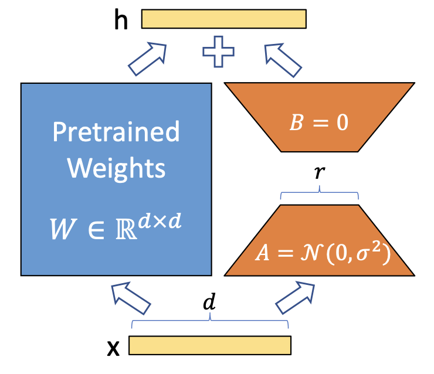
</div>
</br>

在微调训练 (fine-tuning) 时固定预训练 (Pre-trained) 的结果 $W \in \mathbb{R}^{d \times d}$ , 只更新 $A \in \mathbb{R}^{d \times r} , B \in \mathbb{R}^{r \times d}$ 。用随机高斯分布初始化 $A$ ，用 $0$ 矩阵初始化 $B$ . 具体来说可表示为：

$$W + \Delta W = W + B \times A $$

由于 $r \ll d$ ，因此需要更新的参数量 $2rd$ 远小于原始模型的参数量 $d^2$ ，从而大大减少了微调的时间和计算成本。

在前向推理时，LoRA可以不引入推理延迟，只需要将预训练模型参数 $W$ 与LoRA参数 $A, B$ 进行合并即可得到微调后的模型参数: $W + B \times A$ , 因此前向过程可表述为：

$$h = (W + B \times A)x $$

微调以Transformer为基础的大语言模型时，可以对 $W_Q, W_K, W_V$ 矩阵应用LoRa技术，在获得不错效果同时减少微调成本。

## Vision Transformer

[ViT](https://arxiv.org/abs/2010.11929) (Vision Transformer) 是将Transformer应用在视觉领域的例子，其结构如下图所示。

<div align=center>
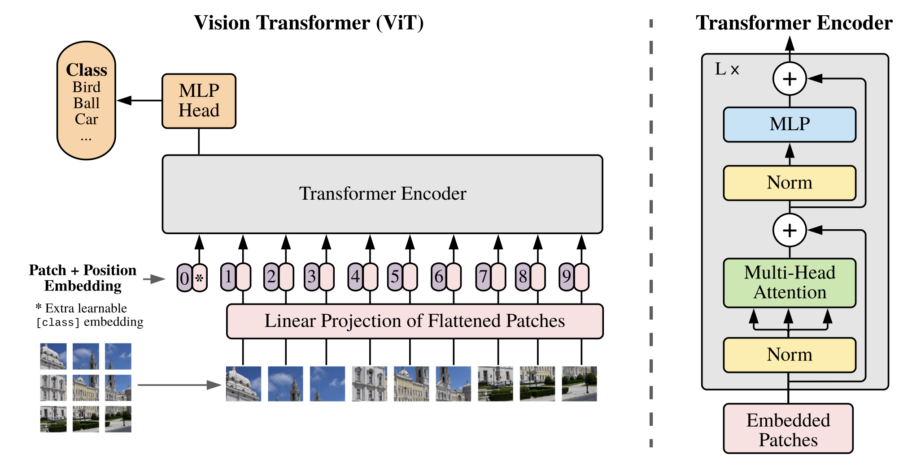
</div>
</br>

其基本思想是对输入图片分块，展平成一维向量后通过一个线性层压缩，然后和位置向量一起送入transformer encoder中，最后通过一个MLP得到分类结果。由于ViT中只有encoder，因此额外添加一个可学习的class embedding作为输入，在encoder输出时选取这一个向量对应的输出作为MLP的输入，完成分类计算。

## Reference

- [BLEU值](https://www.cnblogs.com/duye/p/10680058.html)
- [循环神经网络 RNN、LSTM、GRU](https://www.jianshu.com/p/247a72812aff)
- [Seq2Seq 模型详解](https://www.jianshu.com/p/80436483b13b)
- [Attention 图解](https://zhuanlan.zhihu.com/p/342235515)
- [Transformer 模型详解](https://zhuanlan.zhihu.com/p/48508221)
- [LoRa 简读](https://zhuanlan.zhihu.com/p/514033873)
- [Vision Transformer](https://zhuanlan.zhihu.com/p/317756159)